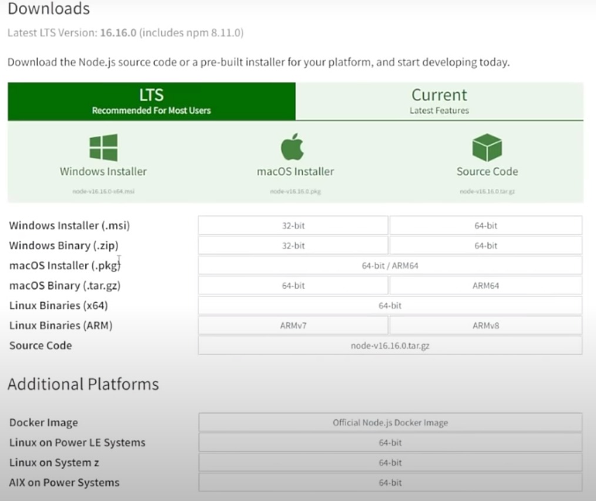
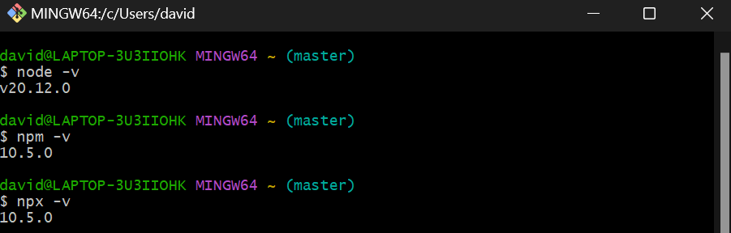
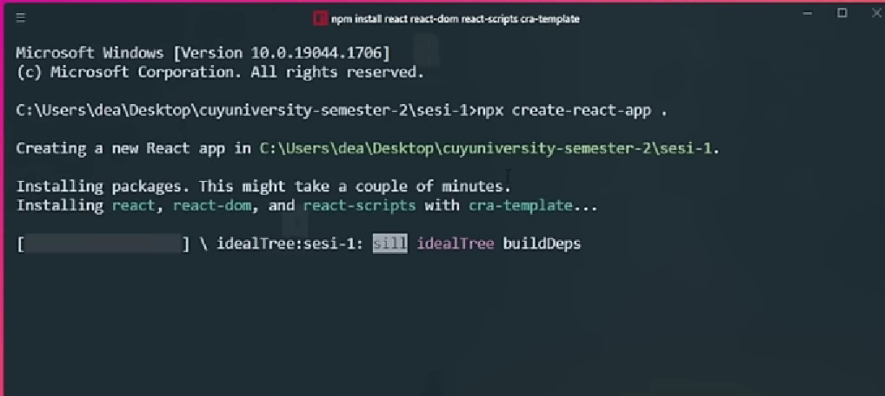
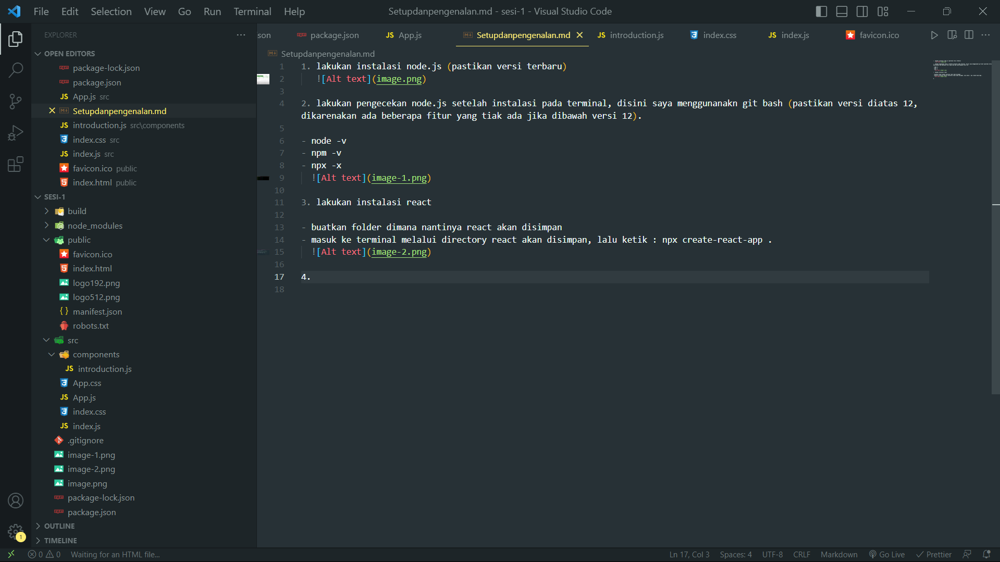
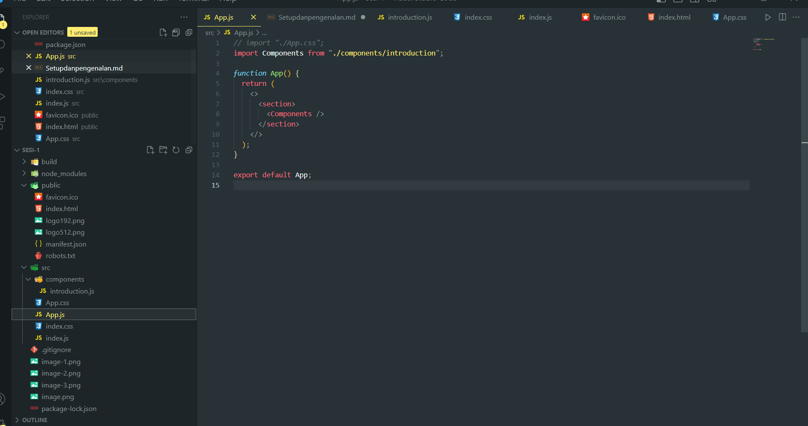

1. lakukan instalasi node.js (pastikan versi terbaru)
   

2. lakukan pengecekan node.js setelah instalasi pada terminal, disini saya menggunanakn git bash (pastikan versi diatas 12, dikarenakan ada beberapa fitur yang tiak ada jika dibawah versi 12).

- node -v
- npm -v
- npx -x
  

3. lakukan instalasi react

- buatkan folder dimana nantinya react akan disimpan
- masuk ke terminal melalui directory react akan disimpan, lalu ketik : npx create-react-app .
  

4. masuk kedalam text editor, an akan muncul struktur folder seperti dibawah ini:
   
   artinya berhasil, dimana kita sudah menginstall reactnya.

5. inti utama dimana code kita akan dijalankan ialah pada folder src/App.js terlihat seperti code saya dibawah ini:  
    
   dimana saya melakukan import dari folder components yang isinya introduction dan didalam introduction tersebut terapat function components. dan ketika dijalankan :
   "npm run start", dibawah ini hasilnya
   

- SELESAI -
